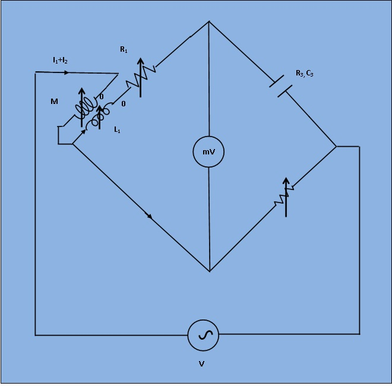

## Introduction

***Circuit diagram for measurement of capacitance by Carey Foster Bridge*** To determine the capacitance of an unknown capacitor in-terms of standard mutual inductance.  

This bridge is a modification of carey foster bridge. It is used to measure the capacitance interms of standard mutual inductances and is then known as Carey foster bridge.

***Figure 1: Circuit diagram for measurement of capacitance by Carey Foster Bridge***

