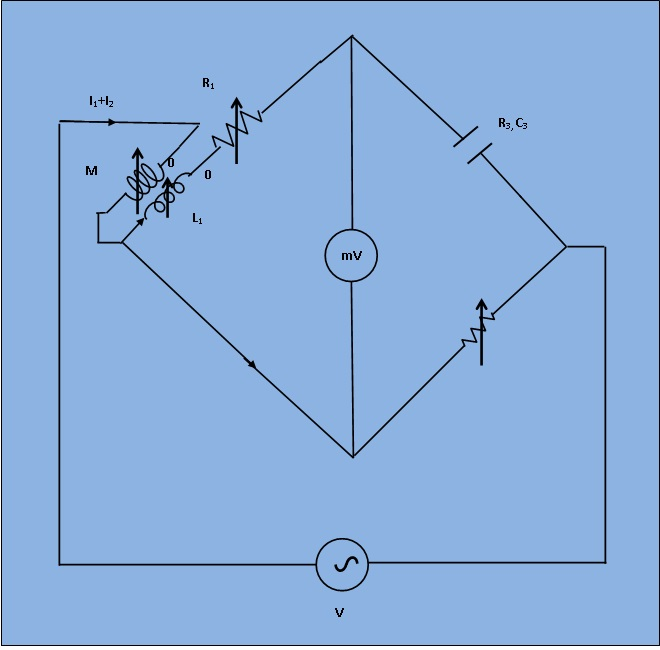

# Introduction

***Foster Bridge*** To determine the capacitance of an unknown capacitor in-terms of standard mutual inductance.  

This bridge is a modification of carey foster bridge. It is used to measure the capacitance interms of standard mutual inductances and is then known as Carey foster bridge. 

***Figure 1: Circuit diagram for measurement of capacitance by Carey Foster Bridge***
The circuit diagram is shown in figure 1 under balance condition. This bridge has an unusual feature, one of its arm is short circuited and therefore the potential drop across this arm is zero. In order to achieve balance, the potential drop across opposite arm should also be equal to zero and for this reason negative coupling is needed for the mutual inductance. 

At balance, 

`I_1 * (R_1 + j*omega*L_1) - (I_1 + I_2)*j*omega*M = 0`

`I_1 * (R_3 + 1/ (j*omega*C_3)) = I_1*R_4 `

 If the above bridge is used to measurement of capacitance ,  it may be written as 

`C_3 = M/(R_1*R_4)`

`R_3 = R_4*(L_1 - M)/M `

While in measurement of capacitance C3,  R3   is not a separate unit but represents the equivalent series resistance of the capacitor and thus can be determined in terms of the elements of the bridge.
## Theory

***Foster Bridge*** To determine the capacitance of an unknown capacitor in-terms of standard mutual inductance.  

This bridge is a modification of carey foster bridge. It is used to measure the capacitance interms of standard mutual inductances and is then known as Carey foster bridge. 

***Figure 1: Circuit diagram for measurement of capacitance by Carey Foster Bridge***
The circuit diagram is shown in figure 1 under balance condition. This bridge has an unusual feature, one of its arm is short circuited and therefore the potential drop across this arm is zero. In order to achieve balance, the potential drop across opposite arm should also be equal to zero and for this reason negative coupling is needed for the mutual inductance. 

At balance, 

`I_1 * (R_1 + j*omega*L_1) - (I_1 + I_2)*j*omega*M = 0`

`I_1 * (R_3 + 1/ (j*omega*C_3)) = I_1*R_4 `

 If the above bridge is used to measurement of capacitance ,  it may be written as 

`C_3 = M/(R_1*R_4)`

`R_3 = R_4*(L_1 - M)/M `

While in measurement of capacitance C3,  R3   is not a separate unit but represents the equivalent series resistance of the capacitor and thus can be determined in terms of the elements of the bridge.

